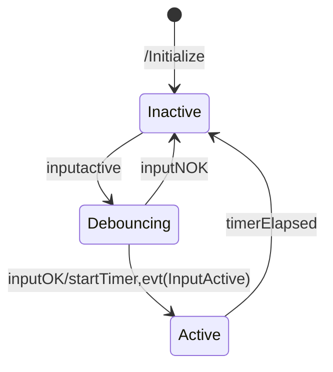

The state diagram below depict the behavior of the alarm.

```mermaid

stateDiagram-v2

  stateDiagram-v2

    [*] --> IDLE : /Initialize

    IDLE-->AIRPORTCALLING : AirportCallActive/lampOn,SireneOn,setTimer
    IDLE-->MANUALSET : ManualSet
    AIRPORTCALLING-->CONSTANTON : AirportCallInactive/SireneOff
    MANUALSET-->CONSTANTON : FlashTimeElapsed
    CONSTANTON-->RESETTING : ManualReset//SetFlasTimer,lampoff,SireneOn
    RESETTING-->IDLE : FlashTimerElapsed/SireneOff
    CONSTANTON-->AIRPORTCALLING : AirportCallActive/lampOn,SireneOn,setTimer
    AIRPORTCALLING-->RESETTING : ManualReset,/SetFlasTimer,lampoff,SireneOn
   AIRPORTCALLING-->AIRPORTCALLING : TimerElapsed/SireneToggle, setTimer
    
  
```

and here the behaviour of the input debouncer

