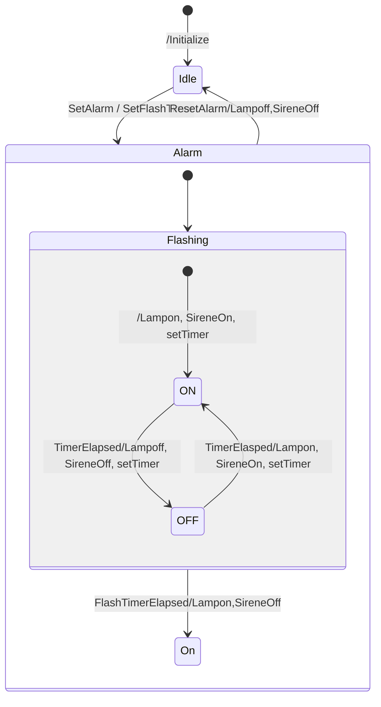

The state diagram below depict the behavior of the alarm.

```mermaid
stateDiagram-v2
    [*] --> Idle : /Initialize
    Idle --> Alarm : SetAlarm / SetFlashTimer
    state Alarm {
      [*]-->Flashing
      state Flashing {
        [*]-->ON : /Lampon, SireneOn, setTimer
        ON-->OFF : TimerElapsed/Lampoff, SireneOff, setTimer
        OFF-->ON : TimerElasped/Lampon, SireneOn, setTimer
      }
      Flashing --> On : FlashTimerElapsed/Lampon,SireneOff
    }
    Alarm --> Idle : ResetAlarm/Lampoff,SireneOff
```
