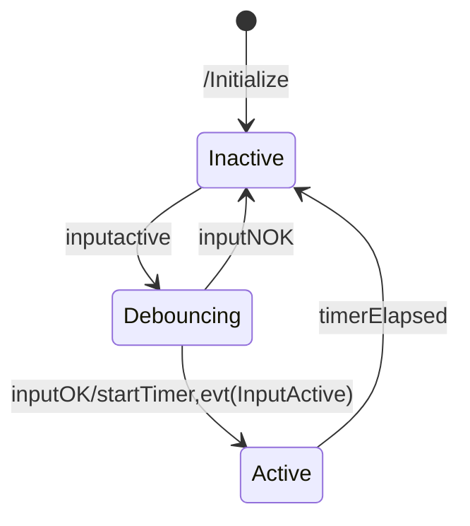

The state diagram below depict the behavior of the alarm.

```mermaid
stateDiagram-v2

stateDiagram-v2

    [*] --> IDLE : /Initialize

    IDLE-->ALARM : SetAlarm 
    IDLE-->MANUALSET : ManualSet
    ALARM-->CONSTANTON : FlashTimerElapsed/Lampon,SireneOff
    MANUALSET-->CONSTANTON : FlashTimeElapsed
    CONSTANTON-->MANUALRESET : ManualReset//SetFlasTimer,lampoff,SireneOn
    MANUALRESET-->IDLE : FlashTimerElapsed/SireneOff
    CONSTANTON-->ALARM : setAlarm
    ALARM-->MANUALRESET : ManualReset/SetFlasTimer,lampoff,SireneOn
    state ALARM {
    [*]-->ON :  / Lampon, SireneOn, setTimer
    ON-->OFF : TimerElapsed/Lampoff, SireneOff, setTimer
    OFF-->ON : TimerElasped/Lampon, SireneOn, setTimer
    }
    CONSTANTON-->SWITCHINGOFF : ResetAlarm
    SWITCHINGOFF-->IDLE : FlashTimerElapsed/lampoff,SireneOff
    state MANUALSET {
        [*]-->BEEPING :/SetFlashTimer
           
    }
    state MANUALRESET {
        [*]-->RESETTING : /SetFlashTimer
    }
    state SWITCHINGOFF {
    [*]-->SWON : /SetFlashTimer,lampoff,SireneOn
    SWON-->SWOFF : TimerElapsed/SetFlashTimer,SireneOff
    SWOFF-->SWON: TimerElapsed/SetFlashTimer,SireneOn
    }
```

and here the behaviour of the input debouncer

