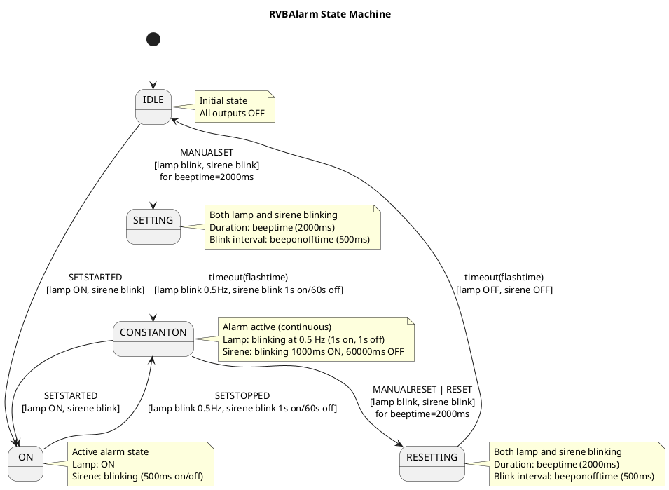
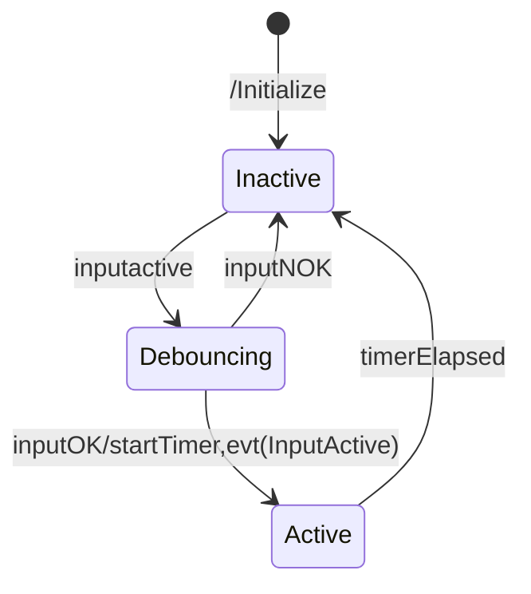

## Alarm Control State Machine

The state diagram below depicts the behavior of the alarm system. For the interactive version, see [state_machine.puml](state_machine.puml).

```plantuml
@startuml RVBAlarm_StateMachine
title RVBAlarm State Machine

[*] --> IDLE

IDLE --> SETTING: MANUALSET\n[lamp blink, sirene blink]\nfor beeptime=2000ms
IDLE --> ON: SETSTARTED\n[lamp ON, sirene blink]

ON --> CONSTANTON: SETSTOPPED\n[lamp blink 0.5Hz, sirene blink 1s on/60s off]

CONSTANTON --> RESETTING: MANUALRESET | RESET\n[lamp blink, sirene blink]\nfor beeptime=2000ms
CONSTANTON --> ON: SETSTARTED\n[lamp ON, sirene blink]

SETTING --> CONSTANTON: timeout(flashtime)\n[lamp blink 0.5Hz, sirene blink 1s on/60s off]

RESETTING --> IDLE: timeout(flashtime)\n[lamp OFF, sirene OFF]

note right of IDLE
  Initial state
  All outputs OFF
end note

note right of SETTING
  Both lamp and sirene blinking
  Duration: beeptime (2000ms)
  Blink interval: beeponofftime (500ms)
end note

note right of ON
  Active alarm state
  Lamp: ON
  Sirene: blinking (500ms on/off)
end note

note right of CONSTANTON
  Alarm active (continuous)
  Lamp: blinking at 0.5 Hz (1s on, 1s off)
  Sirene: blinking 1000ms ON, 60000ms OFF
end note

note right of RESETTING
  Both lamp and sirene blinking
  Duration: beeptime (2000ms)
  Blink interval: beeponofftime (500ms)
end note

@enduml
```

and here the behaviour of the input debouncer

```mermaid
stateDiagram-v2

  
    [*] --> Inactive : /Initialize
    Inactive-->Debouncing : inputactive
    Debouncing -->Inactive : inputNOK
    Debouncing --> Active: inputOK/startTimer,evt(InputActive)
    Active --> Inactive : timerElapsed
 
```