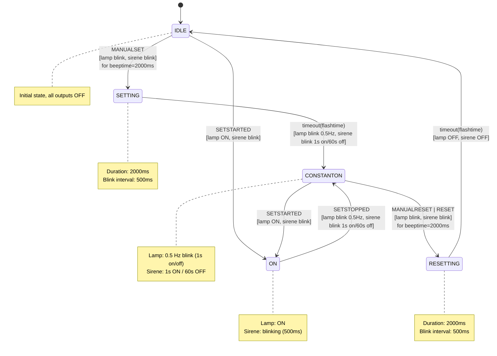
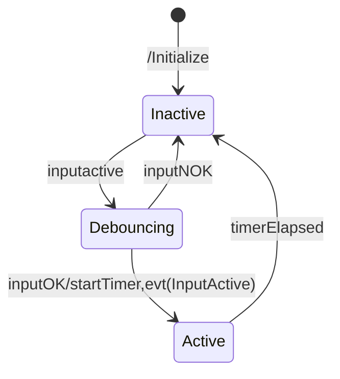

## Alarm Control State Machine

The current alarm state machine is documented below:

```mermaid
stateDiagram-v2
    [*] --> IDLE
    
    IDLE --> SETTING: MANUALSET<br/>[lamp blink, sirene blink]<br/>for beeptime=2000ms
    IDLE --> ON: SETSTARTED<br/>[lamp ON, sirene blink]
    
    ON --> CONSTANTON: SETSTOPPED<br/>[lamp blink 0.5Hz, sirene blink 1s on/60s off]
    
    CONSTANTON --> RESETTING: MANUALRESET | RESET<br/>[lamp blink, sirene blink]<br/>for beeptime=2000ms
    CONSTANTON --> ON: SETSTARTED<br/>[lamp ON, sirene blink]
    
    SETTING --> CONSTANTON: timeout(flashtime)<br/>[lamp blink 0.5Hz, sirene blink 1s on/60s off]
    
    RESETTING --> IDLE: timeout(flashtime)<br/>[lamp OFF, sirene OFF]
    
    note right of IDLE
        Initial state, all outputs OFF
    end note
    
    note right of SETTING
        Duration: 2000ms
        Blink interval: 500ms
    end note
    
    note right of ON
        Lamp: ON
        Sirene: blinking (500ms)
    end note
    
    note right of CONSTANTON
        Lamp: 0.5 Hz blink (1s on/off)
        Sirene: 1s ON / 60s OFF
    end note
    
    note right of RESETTING
        Duration: 2000ms
        Blink interval: 500ms
    end note
```

The PlantUML version is also available in [state_machine.puml](state_machine.puml).

and here the behaviour of the input debouncer

```mermaid
stateDiagram-v2

  
    [*] --> Inactive : /Initialize
    Inactive-->Debouncing : inputactive
    Debouncing -->Inactive : inputNOK
    Debouncing --> Active: inputOK/startTimer,evt(InputActive)
    Active --> Inactive : timerElapsed
 
```